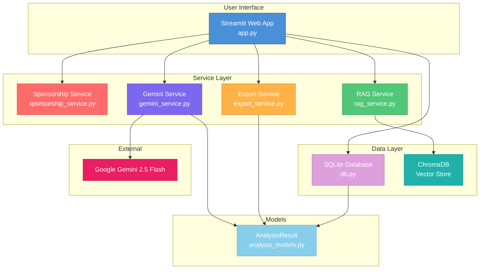
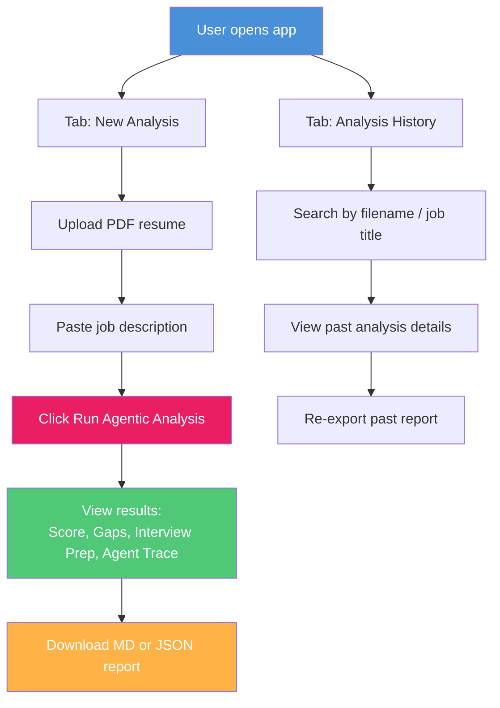
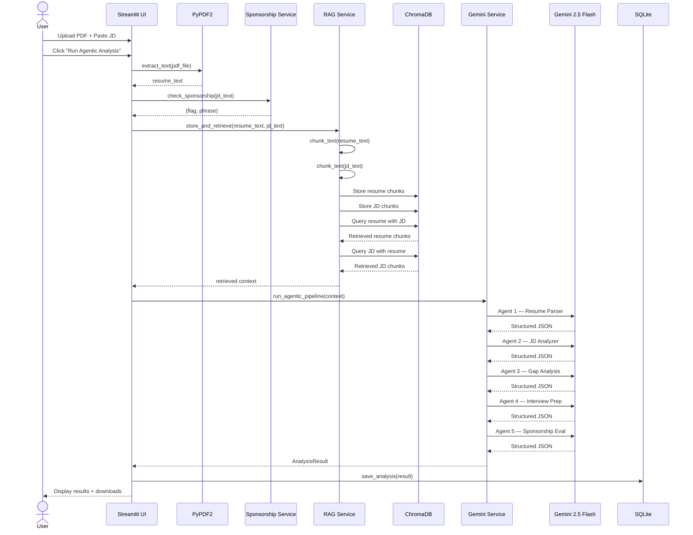
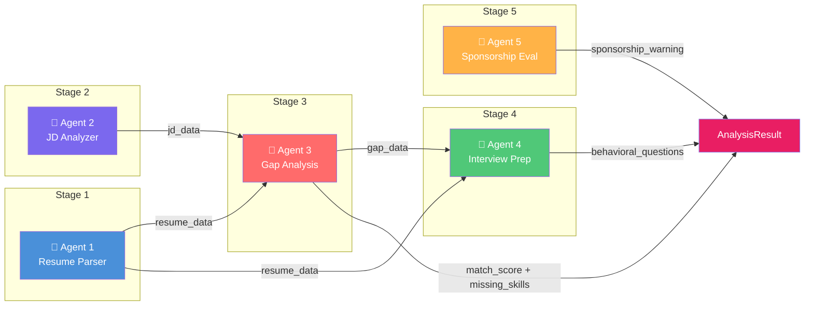
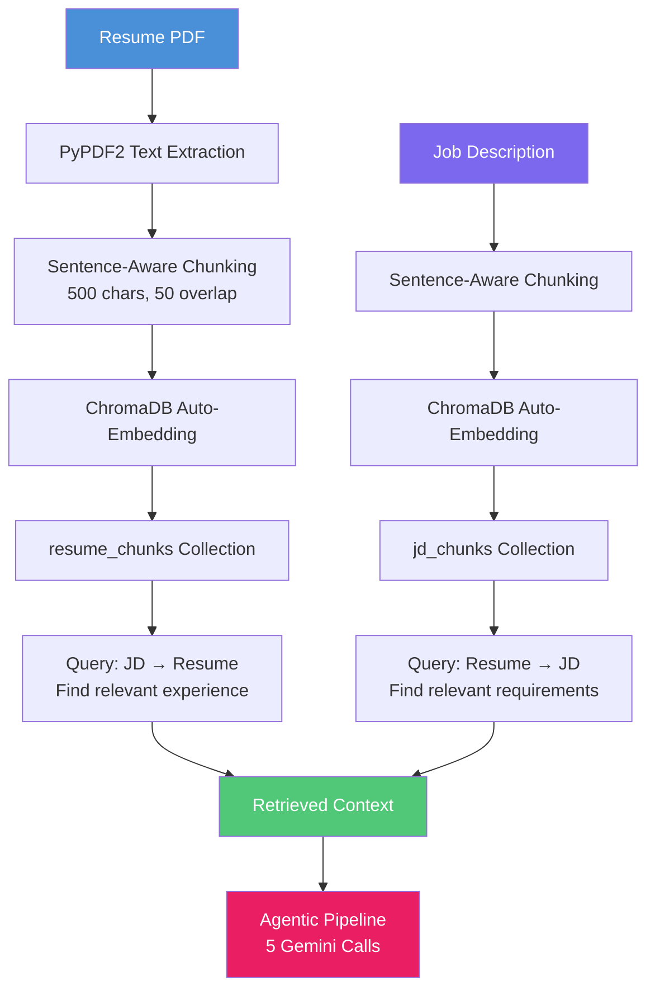
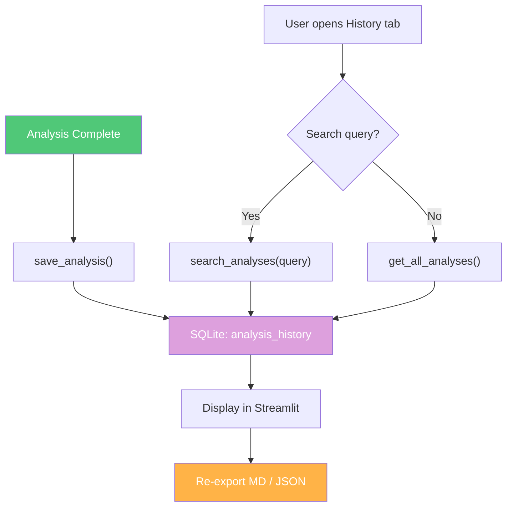

# Logical Structure — AI Career Copilot

## High-Level Architecture

---

## User Flow

---

## Data Flow — Complete Pipeline

---

## Agentic Pipeline Architecture

---

## RAG Pipeline Flow

---

## Database Flow

---

## Component Interaction Summary

| Component | Depends On | Produces |
| :--- | :--- | :--- |
| `app.py` | All services, database, models | Streamlit UI |
| `gemini_service.py` | `analysis_models.py`, Gemini API | `AnalysisResult` |
| `rag_service.py` | ChromaDB | Retrieved context strings |
| `sponsorship_service.py` | None | `(bool, str)` tuple |
| `export_service.py` | `analysis_models.py` | Markdown / JSON strings |
| `db.py` | SQLite | Persisted analysis records |
| `analysis_models.py` | None | Dataclass definitions |

---

## External Services

| Service | Purpose | Auth |
| :--- | :--- | :--- |
| Google Gemini 2.5 Flash | LLM inference (5 agent calls per analysis) | API key in `.env` |
| ChromaDB | Local vector store for RAG embeddings | None (local) |
| SQLite | Local relational database for history | None (local) |
